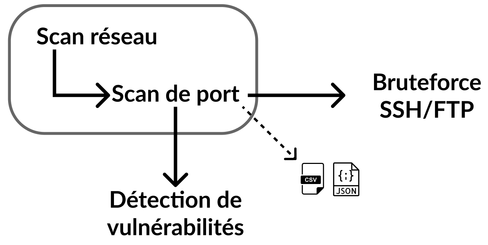

# PROJET TUTEURE
```
 ____  ____   ___      _ _____ _____   _____ _   _ _____ ______   __
|  _ \|  _ \ / _ \    | | ____|_   _| |_   _| | | |_   _|  _ \ \ / /
| |_) | |_) | | | |_  | |  _|   | |     | | | | | | | | | |_) \ V /
|  __/|  _ <| |_| | |_| | |___  | |     | | | |_| | | |_|  __/ | |
|_|   |_| \_\\___/ \___/|_____| |_|     |_|  \___/  |_(_)_|    |_|
```
## Présentation

Script Python (réalisé par Pierre Chaussard) qui a pour bout d'automatiser le scan d'un réseau et de découvrire toutes les vulnérabilités des hôtes présents sur ce réseau.
Si le port 23 du protocole SSH (Secure Shell) est ouvert, le script lance un bruteforce pour tenter d'optenir les identifiants de connexion pour établir une connexion SSH.

Ce script est réalisé dans le cadre d'un exercice du cours de Projet Tuteuré administré par Monsieur BISSORT à l'EFREI.

## Fonctionnalitées

<p align="center">
  
</p>

- Scan du réseau et identifie tous les hôtes.
- Scan des ports de chacuns des hôtes précédement découvert (scan de vulnérabilités avec Nmap).
- Analyse des vulnérabilités via les codes CVE-20XX-XXXX.
- Bruteforce SSH si le port 23 est ouvert.

### Disclaimer
Cet outil ne peut être utilisé qu'à des fins légales. Les utilisateurs assument l'entière responsabilité de toute action effectuée à l'aide de cet outil. L'auteur décline toute responsabilité pour les dommages causés par cet outil. Si ces termes ne vous conviennent pas, n'utilisez pas cet outil.

## Installation

1. Clonez le `repository` à l'aide de la commande : 
```bash
git clone https://github.com/PierreChrd/projet-tut
```

2. Pour installer les modules python, executez la commande : 
```bash
pip install -r requirements.txt
```

## Utilisation

1. Lancez le script :
    - En cliquant sur le fichier `Start.bat`.
    - Avec la commande :
        ```bash
        py projet-tut.py
        ```
2. Entrez une adresse IP connue sur le réseau que vous souhaitez scanner **ou** appuyez sur ENTRER (cela utilisera votre adresse IP locale).
3. Entrez le code CVE qui s'affichera à la fin de l'analyse Nmap.
4. Vous trouverez dans le dossier `scan/`, des fichiers de journalisations JSON (logs) de l'analyse Nmap de tous les hôtes deja scannés.
5. Vous trouverez dans le dossier `cve/`, le résumé du rapport CVE au format JSON.

## Démonstration et expliquations

```bash
 ____  ____   ___      _ _____ _____   _____ _   _ _____ ______   __
|  _ \|  _ \ / _ \    | | ____|_   _| |_   _| | | |_   _|  _ \ \ / /
| |_) | |_) | | | |_  | |  _|   | |     | | | | | | | | | |_) \ V /
|  __/|  _ <| |_| | |_| | |___  | |     | | | |_| | | |_|  __/ | |
|_|   |_| \_\\___/ \___/|_____| |_|     |_|  \___/  |_(_)_|    |_|


Entrer une adresse IP (l'adresse IP de cette machine est par défaut :
192.168.1.1, pour la selectionner appuyez sur ENTRER).
>
```

Le scan du réseau commence alors à ce moment là. Il va nous montrer tous les hôtes qui seront UP (cela se rapproche à la commande `netdiscover` disponible sur [Kali Linux](https://www.kali.org/)).


```bash
Scan réseau en cours ...
==================================================
Hôte    192.168.1.1
Hôte    192.168.1.125
==================================================
```

Suite au scan complet du réseau, le script va lancer un scan Nmap (paramètres du scan : `-sV --script="vuln and safe"`) sur chaque hôte.

Premier hôte :
```bash
Début du scan Nmap pour :       192.168.1.1.
==================================================
PORT: 135
| NAME: msrpc
| PRODUCT: Microsoft Windows RPC
| SCRIPT:
| STATE: open
|_VERSION:
==================================================
PORT: 139
| NAME: netbios-ssn
| PRODUCT: Microsoft Windows netbios-ssn
| SCRIPT:
| STATE: open
|_VERSION:
==================================================
PORT: 445
| NAME: microsoft-ds
| PRODUCT:
| SCRIPT:
| STATE: open
|_VERSION:
==================================================
PORT: 3306
| NAME: mysql
| PRODUCT: MySQL
| SCRIPT:
| STATE: open
|_VERSION:
==================================================
```

Deuxième hôte:
```bash
PORT: 80
| NAME: http
| PRODUCT: Apache httpd
| SCRIPT:
| | HTTP-SERVER-HEADER: Apache/2.4.46 (Win64) PHP/7.3.21
| | HTTP-SLOWLORIS-CHECK:
  VULNERABLE:
  Slowloris DOS attack
    State: LIKELY VULNERABLE
    IDs:  CVE:CVE-2007-6750
      Slowloris tries to keep many connections to the target web server open and hold
      them open as long as possible.  It accomplishes this by opening connections to
      the target web server and sending a partial request. By doing so, it starves
      the http server's resources causing Denial Of Service.

    Disclosure date: 2009-09-17
    References:
      https://cve.mitre.org/cgi-bin/cvename.cgi?name=CVE-2007-6750
      http://ha.ckers.org/slowloris/

| | HTTP-TRACE: TRACE is enabled
| | HTTP-VULN-CVE2017-1001000: ERROR: Script execution failed (use -d to debug)
| | VULNERS:
  cpe:/a:apache:http_server:2.4.46:
        E899CC4B-A3FD-5288-BB62-A4201F93FDCC    10.0    https://vulners.com/githubexploit/E899CC4B-A3FD-5288-BB62-A4201F93FDCC  *EXPLOIT*
        5DE1B404-0368-5986-856A-306EA0FE0C09    10.0    https://vulners.com/githubexploit/5DE1B404-0368-5986-856A-306EA0FE0C09  *EXPLOIT*
        CVE-2022-23943  7.5     https://vulners.com/cve/CVE-2022-23943
        CVE-2022-22720  7.5     https://vulners.com/cve/CVE-2022-22720
        CVE-2021-44790  7.5     https://vulners.com/cve/CVE-2021-44790
        CVE-2021-39275  7.5     https://vulners.com/cve/CVE-2021-39275
        CVE-2021-26691  7.5     https://vulners.com/cve/CVE-2021-26691
        FDF3DFA1-ED74-5EE2-BF5C-BA752CA34AE8    6.8     https://vulners.com/githubexploit/FDF3DFA1-ED74-5EE2-BF5C-BA752CA34AE8  *EXPLOIT*
        CVE-2022-22721  6.8     https://vulners.com/cve/CVE-2022-22721
        CVE-2021-40438  6.8     https://vulners.com/cve/CVE-2021-40438
        CVE-2020-35452  6.8     https://vulners.com/cve/CVE-2020-35452
        8AFB43C5-ABD4-52AD-BB19-24D7884FF2A2    6.8     https://vulners.com/githubexploit/8AFB43C5-ABD4-52AD-BB19-24D7884FF2A2  *EXPLOIT*
        4810E2D9-AC5F-5B08-BFB3-DDAFA2F63332    6.8     https://vulners.com/githubexploit/4810E2D9-AC5F-5B08-BFB3-DDAFA2F63332  *EXPLOIT*
        CVE-2021-44224  6.4     https://vulners.com/cve/CVE-2021-44224
        CVE-2022-22719  5.0     https://vulners.com/cve/CVE-2022-22719
        CVE-2021-36160  5.0     https://vulners.com/cve/CVE-2021-36160
        CVE-2021-34798  5.0     https://vulners.com/cve/CVE-2021-34798
        CVE-2021-33193  5.0     https://vulners.com/cve/CVE-2021-33193
        CVE-2021-30641  5.0     https://vulners.com/cve/CVE-2021-30641
        CVE-2021-26690  5.0     https://vulners.com/cve/CVE-2021-26690
        CVE-2020-9490   5.0     https://vulners.com/cve/CVE-2020-9490
        CVE-2020-13950  5.0     https://vulners.com/cve/CVE-2020-13950
        CVE-2019-17567  5.0     https://vulners.com/cve/CVE-2019-17567
| STATE: open
|_VERSION: 2.4.46
==================================================
```

Ici, on remarque que le script `'vuln and safe'` a trouvé une vulnérabilité.

##### Développé par [Pierre Chaussard](https://github.com/PierreChrd/).
###### Autres ressources : [PyCVESearch](https://github.com/cve-search/PyCVESearch).
